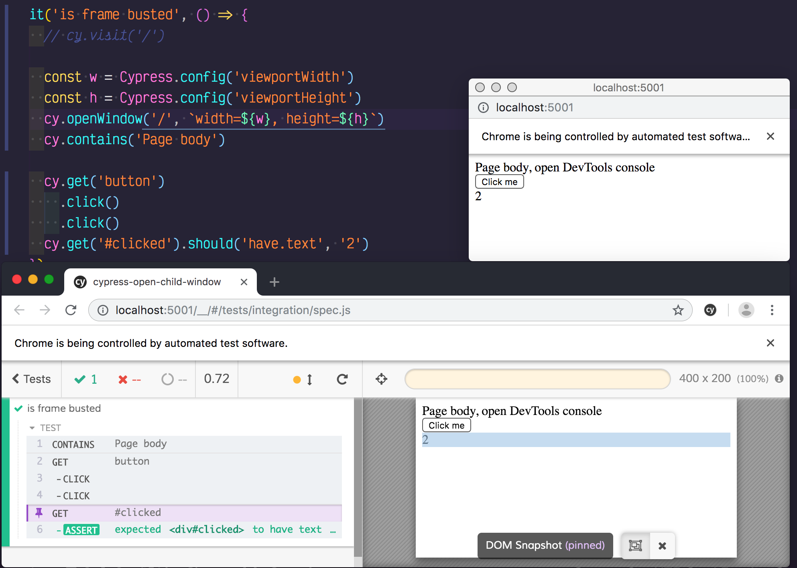
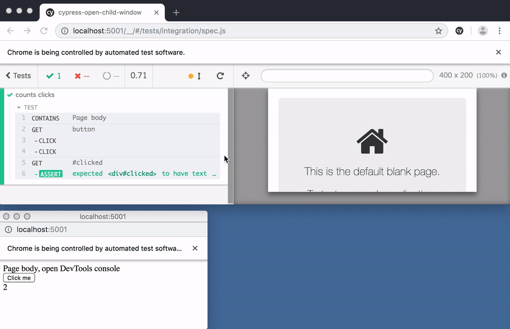

# cypress-open-child-window

Example using `window.open` to "pop" application and test it from Cypress test runner. This allows `top === self` and bypasses what many windows do to frame-bust, see [cypress/issues/886](https://github.com/cypress-io/cypress/issues/886).

See [cypress/integration/spec.js](cypress/integration/spec.js), but basically there is a custom command `cy.openWindow` that uses `window.open` to create a child window linked back synchronously to the opener window. This still lets Cypress work.



To execute (note, requires Chrome browser):

```shell
npm run dev
```

Time traveling debugger should still work - and it shows the snapshots in the iframe, not in the child window


